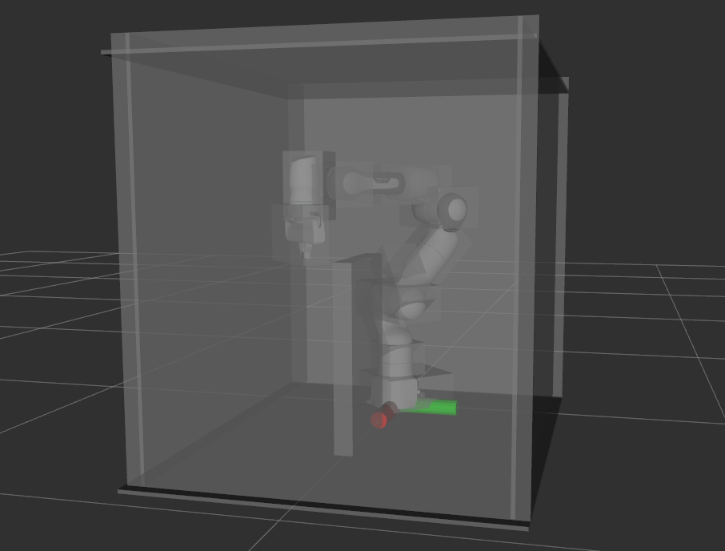
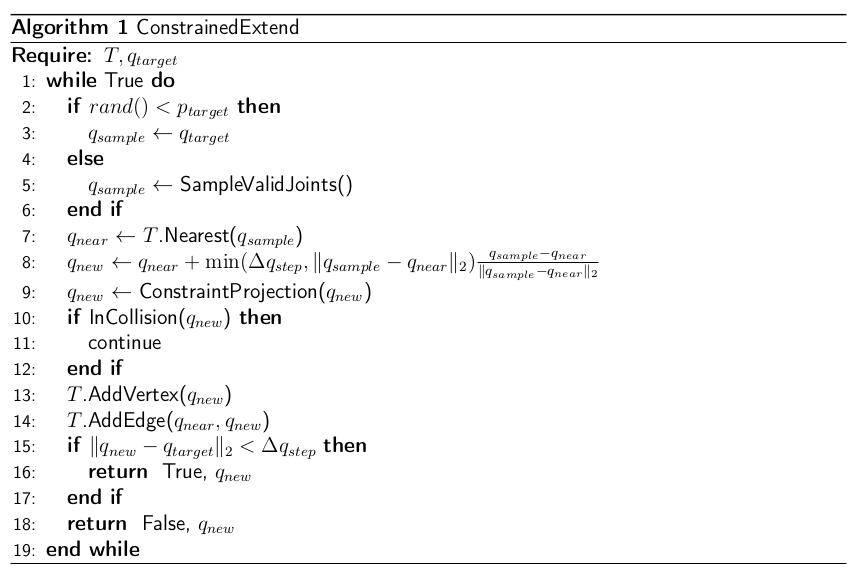

# Kinematics and Path Planning for Franka Panda Robot Arm

This repo has the implementation of basic forward/inverse kinematics, and the RRT path planning for the Franka Robot Arm. 

* [__Kinematics__](./Kinematics): It contains the URDF & DH forward kinematics and the inverse kinematics algorithm for the Franka Robot Arm. It also has the implementation of the [**separating axis theorem**](https://www.jkh.me/files/tutorials/Separating%20Axis%20Theorem%20for%20Oriented%20Bounding%20Boxes.pdf) to avoid collision.

* [__Path Planning__](./Path%20Planning): It contains the Rapidly-exploring Random Trees (RRT) for the Franka robot to reach the target pose without collision with the obstacles. It also has the implementation of the planning with constraints using Projection Sampling.

This is the rViz Visualization of Franka robot, surrounding walls, and an obstacle. You will see this visualization after RRT has found a plan

The Constrained RRT planning algorithm is as below:

* [Here](./Path%20Planning/demo) shows the demo video of both RRT and Constrained RRT for the Franka Robot in the simulation.
